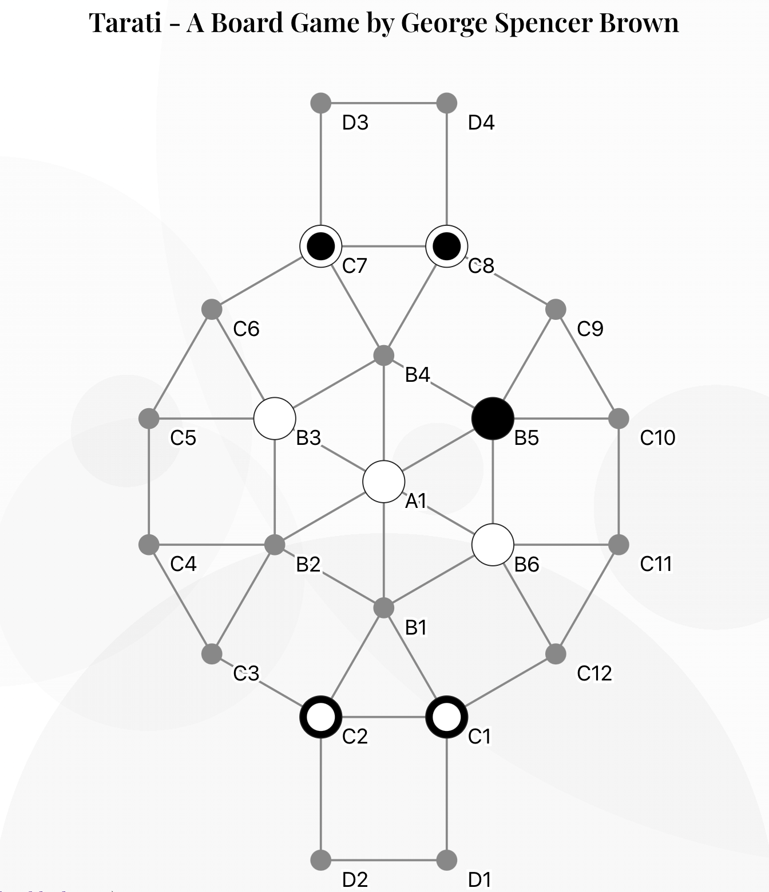

# Tarati - A Boardgame by George Spencer Brown - React App

Welcome to the Tarati Boardgame! It's been designed and copyrighted by George Spencer Brown, the author of the incredible "Laws of Form" which introduces the fundamental Calculus of Distinction. A mathematically complete corpus for notation and calculation with distinctions. If you like to learn more about Laws of Form, check out the following:
- [video by Louis Kauffman](https://youtu.be/UqMl_Wb04nU?si=QWULIQchBawuJr3o)
- Playlist of the [2019 LoF Conference](https://www.youtube.com/watch?v=OnHrvFfeQ3g&list=PLl8xLayCI7YcFU3huTvSPC11xBFioxtpo)
- [LoF Mini Course](https://www.youtube.com/watch?v=VvHYDjkp9Qc&list=PLoK3NtWr5NbqEOdjQrWaq1sDweF7NJ5NB) by Leon Conrad

## Tarati

The Tarati game has a little bit of checkers and chess to its feel: two players with four pawns each start at opposite ends of a board. These are the domestic positions labeled D.



Paws can only move forward, not sideways. When they land on a position with opposite colors next to them, they get hit, and their colors invert.

Landing or hitting a pawn on the opponent's domestic location, upgrades our pawn, allowing it to move in any direction, once. An upgraded pawn is marked. Once a pawn is upgraded, it remains upgraded, even when hit.

The game is over when a player can't move a pawn, or has no more pawns to move. The other player becomes the winner in this case.

## Symbolic Correspondences of Tarati Game

The game has an interesting structure, with overlaps to the ideas of concept structures in terms of their importance. Below a brief description of the game board with alchemical correspondences between brackets:

- We have **4 Pawns** for each player (four elements), and maximally eight (trigrams) at the same time on a board.
- We have **12 Circumference** positions labeled as "C", these correspond to the 12 zodiac or 12 months of the year
- We have **6 Boundary** positions around the center, these correspond with the 6 hermetic planetary concepts.
- We have **1 Absolute Middle** position, labeled as "A", which corresponds to the Sun, or Tipareth.

## AI Algorithm

The Tarati game implements a minimax algorithm with alpha-beta pruning for its AI opponent. Key features include:

- Depth-limited search (configurable, default 8 plies) = variable difficulty
- Position evaluation based on piece count, upgrades, and board control
- Move ordering for improved pruning efficiency

Key concepts developed in AI algorithm:
- Minimax
- Alpha-beta pruning
- Move generation and board evaluation
- Game state representation

## Internal Structure

The app follows a component-based architecture using React hooks. Main components:

1. App (root)
   - Board
     - Vertex (board positions)
     - DraggableChecker (game pieces)
   - Sidebar (game controls)
   - TurnIndicator

Key features:
- Drag-and-drop functionality using `@dnd-kit/core` (mobile and desktop)
- SVG-based board rendering
- Responsive design with `react-responsive`
- Custom hooks for board size and turn indication

Technical aspects:
- React hooks (useState, useEffect, useRef)
- Context API for game state management
- CSS-in-JS for styling (react-spring for animations)
- Custom SVG rendering for game board and pieces

The app structure separates game logic (AI.js, GameBoard.js) from UI components, allowing for easy maintenance and potential future enhancements.

## Local Dev

First npm install

```
npm install
```

Then run the app:
```
npm start
```

The last command will make the app available on `localhost:3000`.

## Build Game

Tarati is deployed for free on GitHub pages. Publish by configuring `gh-pages` correctly, then running:

```
npm run deploy
```

