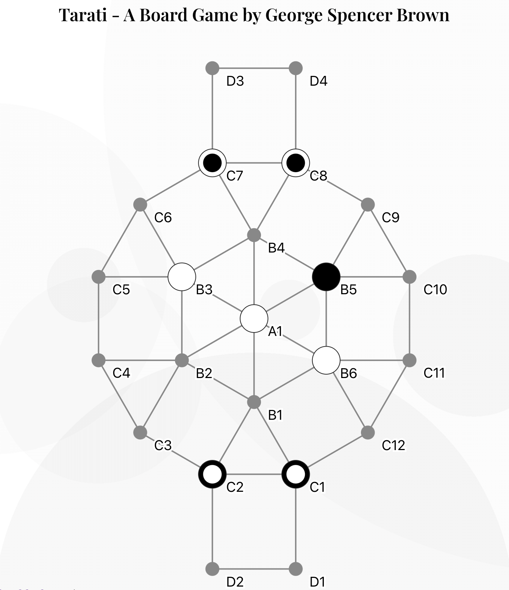

# Tarati - A Boardgame by George Spencer Brown - React App

Welcome to the Tarati Boardgame! It's been designed and copyrighted by George Spencer Brown, the author of the incredible "Laws of Form" which introduces the fundamental Calculus of Distinction. A mathematically complete corpus for notation and calculation with distinctions. If you like to learn more about Laws of Form, check out the following:
- [video by Louis Kauffman](https://youtu.be/UqMl_Wb04nU?si=QWULIQchBawuJr3o)
- Playlist of the [2019 LoF Conference](https://www.youtube.com/watch?v=OnHrvFfeQ3g&list=PLl8xLayCI7YcFU3huTvSPC11xBFioxtpo)
- [LoF Mini Course](https://www.youtube.com/watch?v=VvHYDjkp9Qc&list=PLoK3NtWr5NbqEOdjQrWaq1sDweF7NJ5NB) by Leon Conrad

## Tarati

The Tarati game has a little bit of checkers and chess to its feel: two players with four pawns each start at opposite ends of a board. These are the domestic positions labeled D.



Paws can only move forward, not sideways. When they land on a position with opposite colors next to them, they get hit, and their colors invert.

Landing or hitting a pawn on the opponent's domestic location, upgrades our pawn, allowing it to move in any direction, once. An upgraded pawn is marked. Once a pawn is upgraded, it remains upgraded, even when hit.

The game is over when a player can't move a pawn, or has no more pawns to move. The other player becomes the winner in this case.

## Symbolic Correspondences of Tarati Game

The game has an interesting structure, with overlaps to the ideas of concept structures in terms of their importance. Below a brief description of the game board with alchemical correspondences between brackets:

- We have **4 Pawns** for each player (four elements), and maximally eight (trigrams) at the same time on a board.
- We have **12 Circumference** positions labeled as "C", these correspond to the 12 zodiac or 12 months of the year
- We have **6 Boundary** positions around the center, these correspond with the 6 hermetic planetary concepts.
- We have **1 Absolute Middle** position, labeled as "A", which corresponds to the Sun, or Tipareth.

## AI Algorithm

Tarati uses a bounded **minimax + alpha-beta pruning** engine in both:

- `src/AI.js` (React runtime AI)
- `strategy/engine/ai.py` (Python simulation AI)

Main ideas:

- **Depth-limited search** controls strategic horizon per difficulty.
- **Move ordering** pushes promising lines earlier so alpha-beta can prune more.
- **Transposition table (TT)** avoids re-solving repeated board states in one search.
- **Static evaluation** scores:
  - piece count
  - upgraded pieces
  - terminal states with a large winning score (`WINNING_SCORE`).

### Performance improvements (important)

Hard and Champion can branch aggressively, so the engine now supports budgeted search:

- **`maxMs` / `max_ms`**: time budget per AI move.
- **`maxNodes` / `max_nodes`**: node expansion budget.
- **`rootProbeNodes` / `root_probe_nodes`**: root round-robin probing budget.
- **`stochasticTopK` / `stochastic_top_k`**: weighted random pick among top lines for variety.

Root round-robin probing means the AI does not over-invest in a single first move early.  
It samples each root candidate in slices, then deepens while budget remains. This gives an "anytime" behavior: return the best discovered move even under tight limits.

For the full technical breakdown, see: `strategy/AI_ENGINE.md`

## Simulation Pipeline (`strategy/`)

The `strategy/` folder is the analysis and simulation workspace for AI-vs-AI experiments.

### Notebook flow

- `strategy/01_simulate_games.ipynb`
  - Generates AI-vs-AI games in parallel.
  - Writes full game + move history into SQLite (`strategy/data/games.sqlite`).
  - Supports per-side AI config:
    - `AI_SEARCH_A`
    - `AI_SEARCH_B`
  - These map directly to the engine search options:
    - `max_ms`, `max_nodes`, `root_probe_nodes`, `stochastic_top_k`.
- `strategy/02_analyse_games.ipynb`
  - Reads simulation outputs and computes summary statistics.
- `strategy/03_opener_statistics.ipynb`
  - Focuses on opening move behavior and conversion rates.

### Engine modules used by notebooks

- `strategy/engine/runner.py`: importable game runner for multiprocessing-safe execution.
- `strategy/engine/board.py`: board topology + move application.
- `strategy/engine/ai.py`: search + evaluation.
- `strategy/engine/test_engine.py`: validation tests for rules and engine behavior.

### Running simulations locally

1) Install Python dependencies:

```bash
pip install -r strategy/requirements.txt
```

2) Open and run:

- `strategy/01_simulate_games.ipynb`

3) Tune before large runs:

- `N_GAMES`, `DEPTH_A`, `DEPTH_B`, `MAX_MOVES`, `NUM_WORKERS`
- `AI_SEARCH_A` / `AI_SEARCH_B` budgets (`max_ms` is the most important for responsiveness)

4) Analyse:

- run `strategy/02_analyse_games.ipynb`
- run `strategy/03_opener_statistics.ipynb`

## Internal Structure

The app follows a component-based architecture using React hooks. Main components:

1. App (root)
   - Board
     - Vertex (board positions)
     - DraggableChecker (game pieces)
   - Sidebar (game controls)
   - TurnIndicator

Key features:
- Drag-and-drop functionality using `@dnd-kit/core` (mobile and desktop)
- SVG-based board rendering
- Responsive design with `react-responsive`
- Custom hooks for board size and turn indication

Technical aspects:
- React hooks (useState, useEffect, useRef)
- Context API for game state management
- CSS-in-JS for styling (react-spring for animations)
- Custom SVG rendering for game board and pieces

The app structure separates game logic (AI.js, GameBoard.js) from UI components, allowing for easy maintenance and potential future enhancements.

## Local Dev

First npm install

```
npm install
```

Then run the app:
```
npm start
```

The last command will make the app available on `localhost:3000`.

## Build Game to Github Pages

Tarati is deployed for free on GitHub pages. Publish by configuring `gh-pages` correctly.

Install gh-pages:

```
npm install gh-pages --save-dev
```

Add the following to package.json

```javascript
"scripts": { // <-- in scripts in package.json
    "predeploy": "npm run build", // <== add this
    "deploy": "gh-pages -d build", // <== add this
    "start": "react-scripts start",
    "build": "react-scripts build",
    "test": "react-scripts test",
    "eject": "react-scripts eject"
  },
```

Also add the final github url of your repo to the package.json file:

```javascript
{
  "name": "tarati-react",
  "version": "0.1.0",
  "author": "adamblvck",
  "homepage": "https://adamblvck.github.io/tarati-react",
  "private": false,
  "dependencies": {
    "@dnd-kit/core": "^6.1.0",
    "@dnd-kit/utilities": "^3.2.2",
    ...
  }
  ,
  ...
}

Then run the deploy command:
```
npm run deploy
```

